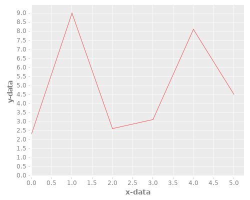

Babel is a meta-programming language for org-mode.

It's the missing piece that will turn this log into a live coding journal.

The part that I'm excited about is that means I'll only have to type in one file.

I'll call it, "Literate Rambling".

[Here](https://orgmode.org/worg/org-contrib/babel/languages/ob-doc-clojure.html) is the documentation for using it with Clojure.

```clojure
(+ 1 4)
```

Unfortunately I'm getting a message that clojure evaluation is disabled.

I did a thing in .spacemacs, but possibly not the right thing.

Oh and maybe it needs to be in a Clojure project folder. Let's hop over there.

Great! It works, let's just make this the new log now.

And I'll upload the new .spacemacs too. Done.

```clojure
(+ 1 4)
```

```clojure
[ 1 2 3 4]
```

```clojure
(def small-map {:a 2 :b 4 :c 8})
(:b small-map)
```

```clojure
(use '(incanter core charts pdf))
;;; Create the x and y data:
(def x-data [0.0 1.0 2.0 3.0 4.0 5.0])
(def y-data [2.3 9.0 2.6 3.1 8.1 4.5])
(def xy-line (xy-plot x-data y-data))
(view xy-line)
(save-pdf xy-line "incanter-xy-line.pdf")
(save xy-line "incanter-xy-line.png")
```


